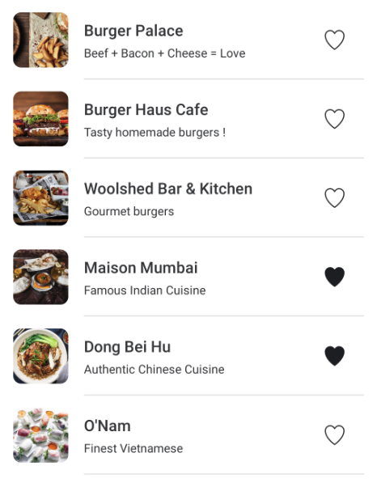

# Wolt 2025 Mobile (Android) Engineering Internships

Preliminary Assignment for Mobile (Android) Engineering internship in 🇫🇮. Welcome! We are delighted to see you applying. Now it's your time to shine.

Please implement the solution for Android using Kotlin as the programming language.

**Please take your time, use the entire time available to complete this to the best of your ability - we do not prioritise submissions by speed!**

## Motivation

The goal of the assignment is to showcase your coding skills and ability to develop realistic features.
This is a highly important part of the hiring process, so it's crucial to put effort into this without making it too bloated.
Based on the results of the assignment review, we will make the decision on whether to proceed to the technical interview.

## Concept

A user is walking around Helsinki city centre looking for a place to eat.

## Task

### Description

Create an application that performs the following functions:

1. Continuously display a list of up to 15 venues near the user’s current location. If the API returns more than 15 venues, display only the first 15 from the list.
2. The user’s location should update every 10 seconds to the next coordinate in the provided input list (below). After the last location in the list, the app should loop back to the first location and repeat the sequence.
3. The venue list should automatically refresh to reflect the new location with a smooth transition animation to enhance visual appeal.
4. Each venue should have a “Favourite” action that toggles (true/false) and changes the icon depending on the state. The app must remember these favourite states and reapply them to venues that appear again even after the app is restarted.

### Location Update Timeline Explanation

| Time passed after opening the app | Current location |
|-----------------------------------|------------------|
| 0 seconds                         | `locations[0]`   |
| 10 seconds                        | `locations[1]`   |
| 20 seconds                        | `locations[2]`   |
| ...                               | ...              |
| (10 * locationsCount) seconds     | `locations[0]` (looped) |

- **0 seconds**: Display venues near `locations[0]`.
- **10 seconds**: Update display to venues near `locations[1]`.
- **20 seconds**: Update display to venues near `locations[2]`.
- Continue updating every 10 seconds until the end of the list is reached, then loop back to `locations[0]` and repeat.

## API Endpoint

`GET https://restaurant-api.wolt.com/v1/pages/restaurants?lat=60.170187&lon=24.930599`

### Important fields in response (JSON)

| Path / Key                                | Meaning                           |
|-------------------------------------------|-----------------------------------|
| `sections -> items -> venue -> id`        | Unique ID of the venue            |
| `sections -> items -> venue -> name`      | Name of the venue                 |
| `sections -> items -> venue -> short_description` | Description of the venue       |
| `sections -> items -> image -> url`       | Image URL for the venue           |

### Coordinates (latitude, longitude)

- `60.169418, 24.931618`
- `60.169818, 24.932906`
- `60.170005, 24.935105`
- `60.169108, 24.936210`
- `60.168355, 24.934869`
- `60.167560, 24.932562`
- `60.168254, 24.931532`
- `60.169012, 24.930341`
- `60.170085, 24.929569`

## Example Assets
Example assets for the favorite icons can be found in the [assets](./assets) directory:

- 
- 

### Example of Minimal Design

## Bonus

- Proven test coverage
- Proper error handling
- Accessibility considerations
## Submitting the assignment
Bundle everything into a Zip archive and upload it to Google Drive, Dropbox or similar and include the link in the application. Remember to check permissions! If we cannot access the file, we cannot review your code. Please don’t store your solution in a public GitHub repository.

A good check before sending your task is to unzip the Zip archive into a new folder and check that building and running the project works, using the steps you define README.md. Forgotten dependencies and instructions can sometimes happen even to the best of us.

## FAQ

#### What will you review in the code I submit?

We treat your code submission as if it were a feature ready for release in our product. We expect your submission to be fully functional, well-structured, clean, and include tests, similar to how real product features are developed. We’ll assess aspects such as code quality, functionality, and user interface to ensure they meet our standards for professional, deployable software.

#### Does my app need to support different screen orientations?

No, portrait mode is sufficient.

#### Do I need to strictly follow the design example?

The provided mockup is just a suggestion. Feel free to design the UI your own way as long as it contains the same information.